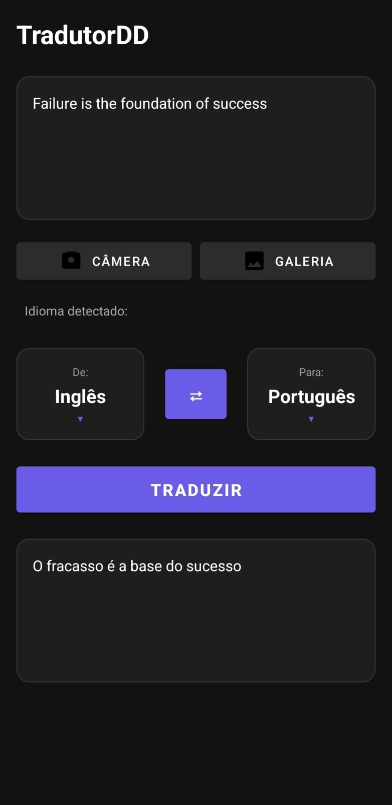
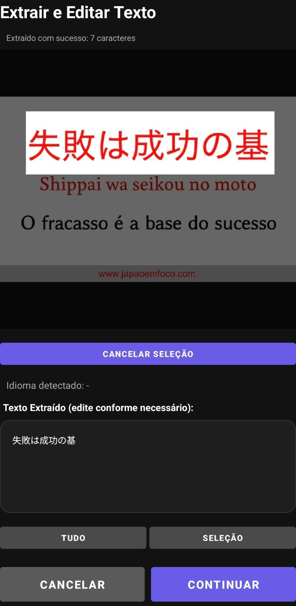

# Manual de Execução — AppTradutor (Android Studio)
### Disciplina: Processamento de imagens
### Discente: Euderlan Freire da Silva Abreu
<div align="center">
  
  
</div>

## 1. Pré-requisitos

Instale os seguintes programas no seu computador:

- **Android Studio** (versão recente)
- **Android SDK** (instalado automaticamente com o Android Studio)
- **JDK** (use a versão embutida no Android Studio)
- **Git** (opcional, para clonar o repositório)

---

## 2. Baixar o Projeto do GitHub

### Opção A — Via Git (Recomendado)

```bash
git clone https://github.com/Euderlan/apptradutor.git
cd apptradutor
```

### Opção B — Baixar ZIP

1. Acesse o repositório no GitHub
2. Clique em **Code** → **Download ZIP**
3. Extraia o arquivo em uma pasta no seu computador

---

## 3. Abrir no Android Studio

1. Abra o **Android Studio**
2. Clique em **Open**
3. Selecione a pasta `apptradutor/`
4. Aguarde o carregamento do projeto

> **Nota:** Quando aparecer a mensagem "Gradle Sync", clique em **Sync Now**

---

## 4. Rodar no Emulador Android

### Criar e Configurar o Emulador

1. No Android Studio, vá em **Tools** → **Device Manager**
2. Clique em **Create device**
3. Escolha um modelo de dispositivo (ex.: Pixel 5) → **Next**
4. Escolha uma imagem do sistema (recomendado: Android 11 ou superior)
5. Conclua a configuração e inicie o emulador com o botão **▶**

### Executar o App 
### Pule para topico 5 para usar no celular

1. No topo do Android Studio, selecione o emulador como dispositivo
2. Clique no botão **Run** (▶)

**Resultado:** O app será instalado e aberto automaticamente no emulador.

> **⚠Limitação:** A câmera no emulador pode ter funcionalidades limitadas. Para testar o OCR com fotos reais, é recomendado usar um celular físico.

---

## 5. Rodar no Celular (Recomendado)

### 5.1 Ativar Modo Desenvolvedor

No seu celular Android:

1. Abra **Configurações** → **Sobre o telefone**
2. Toque **7 vezes** em "Número da versão" para habilitar o modo desenvolvedor
3. Retorne e acesse **Opções do desenvolvedor**
4. Ative a opção **Depuração USB** (USB debugging)

### 5.2 Conectar e Autorizar

1. Conecte o celular no PC via cabo USB
2. No celular, aceite o pop-up **"Permitir depuração USB"**
3. Marque **"Sempre permitir"** (opcional, para futuras conexões)

### 5.3 Executar pelo Android Studio

1. No Android Studio, selecione seu celular na lista de dispositivos
2. Clique no botão **Run** (▶)

**Resultado:** O app será instalado no celular e você poderá testar todas as funcionalidades.

---

## 6. Como Usar o App

### Fluxo Básico

1. Abra o aplicativo
2. Escolha uma das opções:
    - **Câmera**: tire uma foto do texto
    - **Galeria**: selecione uma imagem existente
3. Na tela de visualização, você pode:
    - Extrair o texto da imagem inteira
    - Extrair apenas uma seleção específica
4. Clique em **Traduzir** para traduzir o texto extraído

### Permissões Necessárias

O app solicita as seguintes permissões:

- Acesso à câmera
- Acesso à galeria de imagens
- Acesso à internet
- Funciona Offline (Biblioteca mlkit)

> **ℹInformação:** A tradução funciona através da API **MyMemory** (serviço online)

---

## 7. Execução via Linha de Comando (Opcional)

Na raiz do projeto, você pode usar os seguintes comandos:

### Gerar APK de Debug

```bash
./gradlew assembleDebug
```

### Gerar APK de Release

```bash
./gradlew assembleRelease
```

> **Nota:** Para gerar um APK de release, é necessário ter uma configuração de assinatura digital configurada.

---

## Troubleshooting

Se encontrar problemas:

- **Gradle Sync falha**: Tente **File** → **Invalidate Caches / Restart**
- **Câmera não funciona no emulador**: Use um celular físico ou configure a câmera virtual
- **Permissões negadas**: Verifique se o dispositivo aceitou as permissões na instalação
- **Erro de conexão à internet**: Certifique-se de que o dispositivo tem conexão de rede ativa
