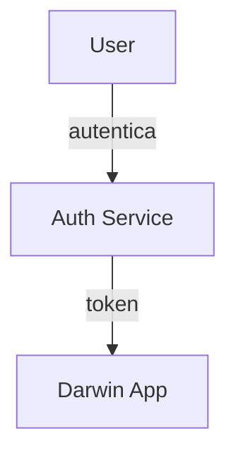

# Guia de Ferramentas e Plugins — VS Code (Darwin)
_Atualizado em **2025-10-07 12:46** (America/Fortaleza)_

Este guia padroniza o **ambiente de edição** do projeto Darwin no **VS Code**.
Integra o melhor dos guias anteriores: tabela completa, links para o Marketplace,
configurações recomendadas, scripts e política de adoção.

> **Como instalar**: `Ctrl+Shift+X` → pesquise pelo nome/ID → **Install**.  
> **Por link**: clique na coluna **Link** (abre uma busca segura do Marketplace).

---

## 1. Extensões obrigatórias (qualidade e produtividade)

| Categoria | Extensão | ID (Marketplace) | Por que usar | Observações/Config | Link |
|---|---|---|---|---|---|
| IA (serviço externo) | **Codex – OpenAI’s coding agent** | `openai.vscode-codex` | Agente único de código do ChatGPT (fora do VS Code) | Requer conta ChatGPT; use no navegador para revisão/ideação | [https://marketplace.visualstudio.com/search?term=openai.vscode-codex&target=VSCode](https://marketplace.visualstudio.com/search?term=openai.vscode-codex&target=VSCode) |
| AI Pair | **GitHub Copilot** | `GitHub.copilot` | Sugestões em tempo real | Habilite *inline suggestions* | [https://marketplace.visualstudio.com/search?term=GitHub.copilot&target=VSCode](https://marketplace.visualstudio.com/search?term=GitHub.copilot&target=VSCode) |
| AI Chat | **GitHub Copilot Chat** | `GitHub.copilot-chat` | Chat contextual com o código | Use `Ctrl+I` para chat inline | [https://marketplace.visualstudio.com/search?term=GitHub.copilot-chat&target=VSCode](https://marketplace.visualstudio.com/search?term=GitHub.copilot-chat&target=VSCode) |
| AI Chat Provider | **Hugging Face Provider for Copilot Chat** | `HuggingFace.huggingface-vscode-copilot-provider` | Provider adicional para o Copilot Chat | Ative/desative por workspace | [https://marketplace.visualstudio.com/search?term=HuggingFace.huggingface-vscode-copilot-provider&target=VSCode](https://marketplace.visualstudio.com/search?term=HuggingFace.huggingface-vscode-copilot-provider&target=VSCode) |
| Markdown | **Markdown All in One** | `yzhang.markdown-all-in-one` | TOC, atalhos, preview | Atalho para TOC e formatação | [https://marketplace.visualstudio.com/search?term=yzhang.markdown-all-in-one&target=VSCode](https://marketplace.visualstudio.com/search?term=yzhang.markdown-all-in-one&target=VSCode) |
| Markdown Preview | **Markdown Preview Enhanced** | `shd101wyy.markdown-preview-enhanced` | Preview avançado (KaTeX, export) | Habilite script execution | [https://marketplace.visualstudio.com/search?term=shd101wyy.markdown-preview-enhanced&target=VSCode](https://marketplace.visualstudio.com/search?term=shd101wyy.markdown-preview-enhanced&target=VSCode) |
| Markdown Style | **Markdown Preview Github Styling** | `bierner.markdown-preview-github-styles` | Preview com estilo do GitHub | — | [https://marketplace.visualstudio.com/search?term=bierner.markdown-preview-github-styles&target=VSCode](https://marketplace.visualstudio.com/search?term=bierner.markdown-preview-github-styles&target=VSCode) |
| Markdown Include | **Markdown Preview Include Files** | `stamminger.markdown-preview-include` | **Transclusão** de `.md` | Útil para docs modulares | [https://marketplace.visualstudio.com/search?term=stamminger.markdown-preview-include&target=VSCode](https://marketplace.visualstudio.com/search?term=stamminger.markdown-preview-include&target=VSCode) |
| Markdown Mermaid | **Markdown Preview Mermaid Support** | `bierner.markdown-mermaid` | Mermaid no preview nativo | Blocos ```mermaid | [https://marketplace.visualstudio.com/search?term=bierner.markdown-mermaid&target=VSCode](https://marketplace.visualstudio.com/search?term=bierner.markdown-mermaid&target=VSCode) |
| Lint | **markdownlint** | `DavidAnson.vscode-markdownlint` | Lint/estilo Markdown | Aplique regras do repositório | [https://marketplace.visualstudio.com/search?term=DavidAnson.vscode-markdownlint&target=VSCode](https://marketplace.visualstudio.com/search?term=DavidAnson.vscode-markdownlint&target=VSCode) |
| Diagramas | **Mermaid Markdown Syntax Highlighting** | `bpruitt-goddard.mermaid-markdown-syntax-highlighting` | Realce para `.mmd`/blocos Mermaid | — | [https://marketplace.visualstudio.com/search?term=bpruitt-goddard.mermaid-markdown-syntax-highlighting&target=VSCode](https://marketplace.visualstudio.com/search?term=bpruitt-goddard.mermaid-markdown-syntax-highlighting&target=VSCode) |
| UML | **PlantUML - Simple Viewer** | `well-ar.plantuml` | Visualização PlantUML | Use com o Syntax | [https://marketplace.visualstudio.com/search?term=well-ar.plantuml&target=VSCode](https://marketplace.visualstudio.com/search?term=well-ar.plantuml&target=VSCode) |
| UML | **PlantUML Syntax** | `qhoekman.plantuml-syntax` | Suporte de linguagem PlantUML | — | [https://marketplace.visualstudio.com/search?term=qhoekman.plantuml-syntax&target=VSCode](https://marketplace.visualstudio.com/search?term=qhoekman.plantuml-syntax&target=VSCode) |
| Python | **Pylance** | `ms-python.vscode-pylance` | Language Server rápido | Type checking básico | [https://marketplace.visualstudio.com/search?term=ms-python.vscode-pylance&target=VSCode](https://marketplace.visualstudio.com/search?term=ms-python.vscode-pylance&target=VSCode) |
| Python | **Python** | `ms-python.python` | Suporte completo a Python/Jupyter | Selecione o *interpreter* do projeto | [https://marketplace.visualstudio.com/search?term=ms-python.python&target=VSCode](https://marketplace.visualstudio.com/search?term=ms-python.python&target=VSCode) |
| Python | **Python Debugger** | `ms-python.debugpy` | Depuração com `debugpy` | `F5` para iniciar | [https://marketplace.visualstudio.com/search?term=ms-python.debugpy&target=VSCode](https://marketplace.visualstudio.com/search?term=ms-python.debugpy&target=VSCode) |
| Python | **Python Environments** | `ms-python.vscode-python-environment-manager` | Gerência de ambientes | `Python: Create Environment` | [https://marketplace.visualstudio.com/search?term=ms-python.vscode-python-environment-manager&target=VSCode](https://marketplace.visualstudio.com/search?term=ms-python.vscode-python-environment-manager&target=VSCode) |
| Dados | **Rainbow CSV** | `mechatroner.rainbow-csv` | Destaque/consultas em CSV/TSV | `Ctrl+Shift+P` → Rainbow CSV | [https://marketplace.visualstudio.com/search?term=mechatroner.rainbow-csv&target=VSCode](https://marketplace.visualstudio.com/search?term=mechatroner.rainbow-csv&target=VSCode) |
| Utilitário | **vscode-pdf** | `tomoki1207.pdf` | Visualizar PDF no VS Code | Útil para anexos | [https://marketplace.visualstudio.com/search?term=tomoki1207.pdf&target=VSCode](https://marketplace.visualstudio.com/search?term=tomoki1207.pdf&target=VSCode) |

> **Política**: use somente extensões aprovadas. Para sugerir novas,
> abra uma _issue_ `devops:` com justificativa, impacto e alternativas.

---

## 2. Extensões opcionais (recomendadas)

| Categoria | Extensão | ID | Quando usar | Link |
|---|---|---|---|---|
| Qualidade | **isort (Microsoft)** | `ms-python.isort` | Padronizar imports com Black/isort | [https://marketplace.visualstudio.com/search?term=ms-python.isort&target=VSCode](https://marketplace.visualstudio.com/search?term=ms-python.isort&target=VSCode) |
| Shell/DevOps | **PowerShell** | `ms-vscode.PowerShell` | Projetos com scripts/profiles `pwsh` | [https://marketplace.visualstudio.com/search?term=ms-vscode.PowerShell&target=VSCode](https://marketplace.visualstudio.com/search?term=ms-vscode.PowerShell&target=VSCode) |
| Markdown | **Markdown Preview VS Code Highlighting** | `bierner.markdown-code-toggle` | Realce de código no preview nativo | [https://marketplace.visualstudio.com/search?term=bierner.markdown-code-toggle&target=VSCode](https://marketplace.visualstudio.com/search?term=bierner.markdown-code-toggle&target=VSCode) |

---

## 3. Arquivo recomendado — `.vscode/extensions.json`

Inclua este arquivo na raiz para sugerir instalações ao time:

```json
{
  "recommendations": ['openai.vscode-codex', 'GitHub.copilot', 'GitHub.copilot-chat', 'HuggingFace.huggingface-vscode-copilot-provider', 'yzhang.markdown-all-in-one', 'shd101wyy.markdown-preview-enhanced', 'bierner.markdown-preview-github-styles', 'stamminger.markdown-preview-include', 'bierner.markdown-mermaid', 'DavidAnson.vscode-markdownlint', 'bpruitt-goddard.mermaid-markdown-syntax-highlighting', 'well-ar.plantuml', 'qhoekman.plantuml-syntax', 'ms-python.vscode-pylance', 'ms-python.python', 'ms-python.debugpy', 'ms-python.vscode-python-environment-manager', 'mechatroner.rainbow-csv', 'tomoki1207.pdf', 'ms-python.isort', 'ms-vscode.PowerShell', 'bierner.markdown-code-toggle']
}
```

> Para instalação em lote via **CLI** (VS Code):  
> `code --install-extension <ID>` por item, ou use o script abaixo.

```bash
# instala as recomendações (requer 'jq' e 'code' no PATH)
cat .vscode/extensions.json | jq -r '.recommendations[]' | xargs -I {} code --install-extension {}
```

---

## 4. Configurações VS Code — `.vscode/settings.json` (base)

```jsonc
{
  "files.eol": "\n",
  "editor.formatOnSave": true,
  "editor.rulers": [88, 120],
  "editor.tabSize": 2,
  "files.trimTrailingWhitespace": true,

  "editor.inlineSuggest.enabled": true,

  "markdownlint.config": {
    "default": true,
    "MD013": false,
    "MD033": false,
    "MD041": false
  },

  "markdown-preview-enhanced.previewTheme": "github-light.css",
  "markdown-preview-enhanced.enableScriptExecution": true,

  "markdown.preview.scrollPreviewWithEditor": true,
  "markdown.preview.openMarkdownLinks": "inPreview",

  "python.defaultInterpreterPath": "C:/ProgramData/miniforge3/python.exe",
  "python.analysis.typeCheckingMode": "basic",
  "python.testing.pytestEnabled": true,
  "python.testing.unittestEnabled": false,

  "editor.codeActionsOnSave": {
    "source.organizeImports": true
  }
}
```

---

## 5. Convenções de diagramas

- **Mermaid**: casos de uso, sequências simples, fluxos.
- **PlantUML**: componentes, implantações e diagramas avançados.
- Versione **.mmd**/**.puml** junto dos `.md` e referencie por caminho relativo.

Exemplo _Mermaid_ (caso de uso):



---

## 6. Scripts úteis

### Instalar recomendações automaticamente
```bash
# instala recomendações do extensions.json (requer code CLI)
cat .vscode/extensions.json | jq -r '.recommendations[]' | xargs -I {} code --install-extension {}
```

### Lint de Markdown (local)
```bash
npx markdownlint-cli2 **/*.md
```

---

## 7. Boas práticas

- **Estabilidade > novidade**: evite plugins fora da lista.
- Formate e rode lint antes do commit.
- Para diagramas grandes, use **arquivos dedicados** e `include` nos `.md`.
- Versione configurações de workspace em `.vscode/settings.json`.

---

## 8. Padrões de commit (exemplos)

- `docs: adiciona guia de extensões VS Code (Darwin)`
- `chore(vscode): habilita inline suggestions e isort`
- `docs(markdown): ativa Mermaid no preview nativo`

---

### Manutenção

- Revisão trimestral deste guia.
- Atualize **IDs** e recomendações conforme a equipe evoluir.
