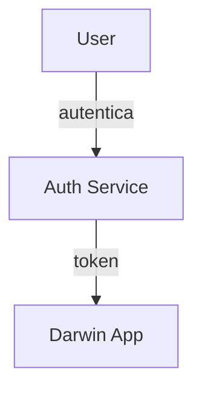

# Guia de Ferramentas e Plugins — VS Code (Darwin)
_Atualizado em **2025-10-01 03:34**_

Este guia padroniza o **ambiente de edição** do projeto Darwin usando **VS Code**.
Inclui **extensões aprovadas**, **por que usar**, **configurações** e **atalhos de uso**.

---

## 1. Extensões obrigatórias (qualidade e produtividade)
| Categoria | Extensão | ID (Marketplace) | Por que usar | Observações/Config |
|---|---|---|---|---|
| AI Coding | **Codex – OpenAI’s coding agent** | `openai.vscode-codex` | agente único para codar em múltiplos contextos | habilitar login e workspace trust |
| AI Pair | **GitHub Copilot** | `GitHub.copilot` | sugestões em tempo real | requer conta habilitada |
| AI Chat | **GitHub Copilot Chat** | `GitHub.copilot-chat` | chat contextual com código | |
| AI Chat Provider | **Hugging Face Provider for Copilot Chat** | `HuggingFace.huggingface-vscode-copilot-provider` | amplia capacidades do chat do Copilot | uso opcional controlado |
| Markdown | **Markdown All in One** | `yzhang.markdown-all-in-one` | TOC, atalhos, preview | define atalhos para cabeçalhos/TOC |
| Markdown Preview | **Markdown Preview Enhanced** | `shd101wyy.markdown-preview-enhanced` | recursos avançados no preview | útil para diagramas e export |
| Markdown Style | **Markdown Preview Github Styling** | `bierner.markdown-preview-github-styles` | preview com estilo GitHub | |
| Markdown Include | **Markdown Preview Include Files** | `stamminger.markdown-preview-include` | permite **transclusão** de `.md` | usar com parcimônia |
| Markdown Mermaid | **Markdown Preview Mermaid Support** | `bierner.markdown-mermaid` | suporte a **Mermaid** no preview | |
| Markdown Highlight | **Markdown Preview VS Code Highlighting** | `bierner.markdown-code-toggle` | destaque de código no preview | |
| Lint | **markdownlint** | `DavidAnson.vscode-markdownlint` | lint/estilo Markdown | regras básicas do repositório |
| Diagramas | **Mermaid Markdown Syntax Highlighting** | `bpruitt-goddard.mermaid-markdown-syntax-highlighting` | realce do Mermaid | |
| UML | **PlantUML - Simple Viewer** | `well-ar.plantuml` | visualização PlantUML | |
| UML | **PlantUML Syntax** | `qhoekman.plantuml-syntax` | suporte de linguagem | |
| Python | **Pylance** | `ms-python.vscode-pylance` | language server para Python | |
| Python | **Python** | `ms-python.python` | extensão principal Python | |
| Python | **Python Debugger** | `ms-python.debugpy` | depuração | |
| Python | **Python Environments** | `ms-python.vscode-python-environment-manager` | gerência de ambientes | |
| Dados | **Rainbow CSV** | `mechatroner.rainbow-csv` | CSV com destaque e consultas | `Ctrl+Shift+P` → Rainbow CSV |
| Utilitário | **vscode-pdf** | `tomoki1207.pdf` | visualizar PDF no VS Code | útil para revisar anexos |

> **Política**: use somente extensões aprovadas. Solicitações de novas extensões devem abrir _issue_ `devops:` com justificativa, impacto e alternativas.

---

## 2. Arquivo recomendado — `.vscode/extensions.json`
Inclua este arquivo no **raiz do repositório** para sugerir instalações ao time:

```json
{
  "recommendations": [
    "openai.vscode-codex",
    "GitHub.copilot",
    "GitHub.copilot-chat",
    "HuggingFace.huggingface-vscode-copilot-provider",
    "yzhang.markdown-all-in-one",
    "shd101wyy.markdown-preview-enhanced",
    "bierner.markdown-preview-github-styles",
    "stamminger.markdown-preview-include",
    "bierner.markdown-mermaid",
    "DavidAnson.vscode-markdownlint",
    "bpruitt-goddard.mermaid-markdown-syntax-highlighting",
    "well-ar.plantuml",
    "qhoekman.plantuml-syntax",
    "ms-python.vscode-pylance",
    "ms-python.python",
    "ms-python.debugpy",
    "ms-python.vscode-python-environment-manager",
    "mechatroner.rainbow-csv",
    "tomoki1207.pdf"
  ]
}
```

---

## 3. Configurações VS Code — `.vscode/settings.json` (base)
```json
{
  "files.eol": "\n",
  "editor.formatOnSave": true,
  "editor.rulers": [88, 120],
  "editor.tabSize": 2,
  "files.trimTrailingWhitespace": true,

  "markdownlint.config": {
    "default": true,
    "MD013": false,
    "MD033": false,
    "MD041": false
  },

  "markdown-preview-enhanced.previewTheme": "github-light.css",
  "markdown-preview-enhanced.enableScriptExecution": true,

  "python.analysis.typeCheckingMode": "basic",
  "python.testing.pytestEnabled": true,
  "python.testing.unittestEnabled": false
}
```

---

## 4. Convenções de diagramas
- **Mermaid** preferido para casos de uso, sequências simples e fluxos.  
- **PlantUML** quando precisar de recursos avançados (componentes/implantações complexas).  
- Sempre versionar **.mmd**/**.puml** junto dos `.md`. Referencie via caminhos relativos.

Exemplo _Mermaid_ (caso de uso):


---

## 5. Scripts úteis
### Instalar recomendações automaticamente
```bash
# instala recomendações do extensions.json (requer code CLI)
cat .vscode/extensions.json | jq -r '.recommendations[]' | xargs -I {} code --install-extension {}
```

### Lint de Markdown (local)
```bash
npx markdownlint-cli2 **/*.md
```

---

## 6. Boas práticas
- **Sem plugins exóticos** fora da lista — estabilidade > novidade.
- Padronize formatação e lint antes do commit.
- Para diagramas grandes, prefira **arquivos dedicados** e `include` no Markdown.
